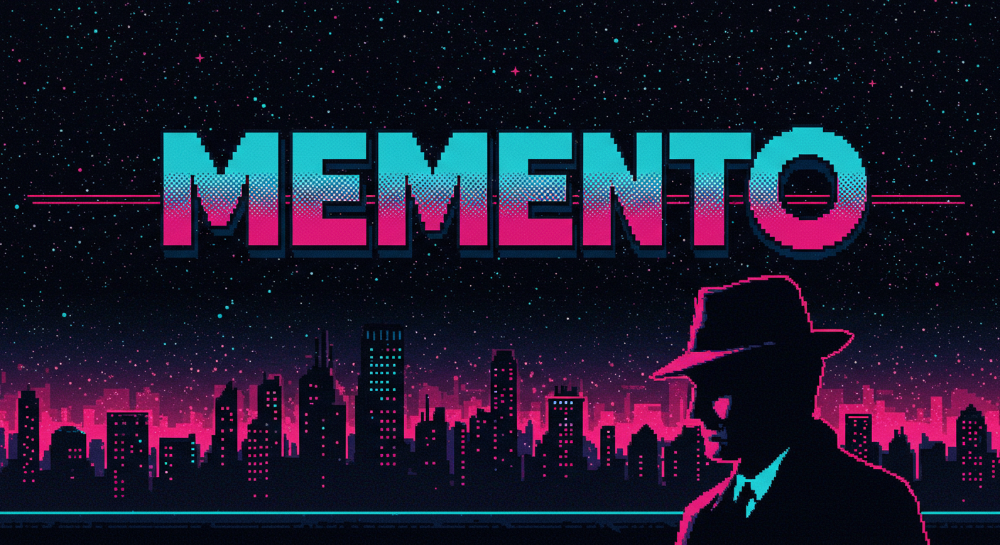
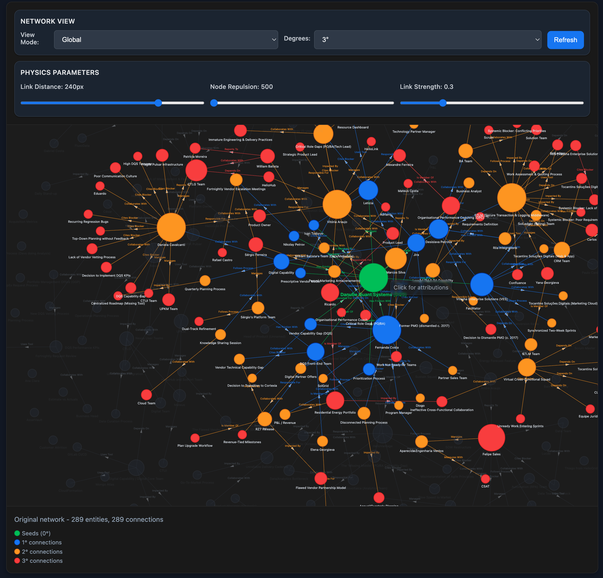

[](https://opensource.org/licenses/MIT)

---

## What is MEMENTO?

MEMENTO is a structured framework for AI-assisted development that solves the **contextual amnesia problem** - the challenge of maintaining knowledge and context across development sessions when working with AI assistants.

## Live Demo

Experience the frontend of a complete organisational intelligence system built in 13 days using MEMENTO:

```bash
docker run -p 8090:8090 jblanch888/heliovantage-demo
```

Visit http://localhost:8090 to explore the search and network visualization interface.


*Organisational intelligence interface with semantic search and network visualisation*

**What this demonstrates:**
- Complete AI system development in 13 days using MEMENTO's structured approach
- Systematic AI collaboration enabling rapid delivery of sophisticated functionality
- Evidence-first methodology producing professional, working systems

*Note: This demo shows only the frontend interface. The complete system includes ML pipelines, intelligence layers, and analytics built during the same 13-day development cycle.*

Unlike productivity hacks or simple documentation systems, MEMENTO provides a **living memory prosthesis** that evolves with your project, capturing patterns, preserving decisions, and enabling systematic collaboration between human expertise and artificial intelligence.

### The Problem MEMENTO Solves

AI assistants are extraordinarily capable but fundamentally **amnesiac**. Each session starts fresh, losing valuable context about:
- Architecture decisions and their rationale
- Proven patterns and failed approaches  
- Domain knowledge and business constraints
- Development patterns and anti-patterns
- Project evolution and lessons learned

MEMENTO transforms this limitation into a systematic advantage through **evidence-based development** and **structured knowledge preservation**.

---

## Core Philosophy

### Machine-First Design
MEMENTO is optimised for **AI effectiveness**, not human browsing. Every structure, file format, and pattern is designed around how AI assistants actually process and utilise information.

### Token Investment Philosophy
Quality context is worth the investment. MEMENTO typically uses 40-60% of session tokens on context, because **clarity costs tokens but confusion costs projects**.

### The Iceberg Architecture
Knowledge is organised in depth layers, like an iceberg:

- **Working Context** (surface): Tiny, session-specific, immediate focus
- **Active Knowledge** (shallow): Frequently referenced, current priorities  
- **Institutional Memory** (deep): Searchable archive of proven patterns
- **Evidence Archive** (deepest): Historical artifacts and investigation results

You live at the surface but dive deeper when you need wisdom, context, or evidence.

---

## Framework Structure

```
memento-framework/
├── protocols/
│   ├── CORE_DIRECTIVES.md          # 11 immutable operational rules
│   └── playbooks/                  # Situational procedures
│       ├── PLANNING_PLAYBOOK.md
│       ├── DEBUGGING_PLAYBOOK.md
│       ├── REFACTORING_PLAYBOOK.md
│       └── ...
├── memory-prosthesis/
│   ├── working-context/            # Session-specific, temporary
│   │   ├── CURRENT_FOCUS.md       # "What now?"
│   │   └── STATUS.md              # "What accomplished?"
│   ├── active-knowledge/           # Multi-session, frequently accessed
│   │   ├── ARCHITECTURE_PRINCIPLES.md
│   │   ├── BACKLOG.md
│   │   └── SYSTEM_OVERVIEW_TEMPLATE.md
│   ├── institutional-memory/       # Long-term, searchable wisdom
│   │   └── KNOWLEDGE_ARCHIVE.md   # Proven patterns and decisions
│   └── evidence-archive/           # Historical artifacts and research
│       └── README.md
└── assets/                        # Supporting materials and diagrams
```

---

## Key Principles

### 1. Accept AI Limitations
Rather than fighting AI amnesia, MEMENTO embraces it. The framework provides **external memory** that survives session boundaries and enables **systematic knowledge accumulation**.

### 2. Evidence-First Methodology  
Every pattern, decision, and approach must be **evidenced**. MEMENTO prevents self-deception through validation gates and reality checks.

### 3. Systematic Evolution
The framework grows with your project. Patterns emerge from real work, get captured in memory, and evolve into institutional knowledge.

### 4. Attention Efficiency
Information architecture respects cognitive load. Critical information is **immediately accessible**, while detailed context is **systematically retrievable**.

---

## Getting Started

### 1. Clone and Customise
```bash
git clone https://github.com/yourusername/memento-framework.git your-project-memento
cd your-project-memento
```

### 2. Establish Your Principles
Edit `memory-prosthesis/active-knowledge/ARCHITECTURE_PRINCIPLES.md` with your development discipline and decision-making frameworks.

### 3. Set Your Current Focus
Update `memory-prosthesis/working-context/CURRENT_FOCUS.md` with your immediate objectives and active playbook.

### 4. Begin Systematic Development
Follow the procedures in your chosen playbook while maintaining context through the memory prosthesis.

---

## Why MEMENTO Works

### The Evolution Story
MEMENTO emerged from **four failed paradigms** for AI collaboration:

1. **Undefined Problem** - Contextual decay without recognition
2. **Documentation-as-Memory** - Library problem, information retrieval failure  
3. **Quantified Compliance** - Measurement theatre instead of effectiveness
4. **Programmatic Enforcement** - Fighting the assistant instead of collaborating
5. **MEMENTO Framework** - Accepting limitations, providing systematic support

Only MEMENTO survived because it **works with AI nature rather than against it**.

### Evolved Through Practice
MEMENTO emerged from systematic experimentation with AI-assisted development across personal projects and rapid prototypes. The framework distills practical lessons learned from building AI applications, including the HelioVantage organizational intelligence demo created in 13 days using this approach.

---

## Documentation

- **[Field Guide](MEMENTO_FIELD_GUIDE.md)** - Comprehensive implementation guide
- **[Article](docs/)** - Full story and practical guide (also available on GitHub Pages)
- **[Contributing](CONTRIBUTING.md)** - How to contribute to MEMENTO development
- **[Playbooks](protocols/playbooks/)** - Situation-specific procedures

---

## License

MIT License - see [LICENSE](LICENSE) file for details.

---

## Acknowledgments

MEMENTO emerged from the practical experience of orchestrating AI assistants across complex software projects. It represents accumulated wisdom about what actually works in AI-human collaboration, distilled into systematic practice.

*"A structured approach to AI-assisted development."*
