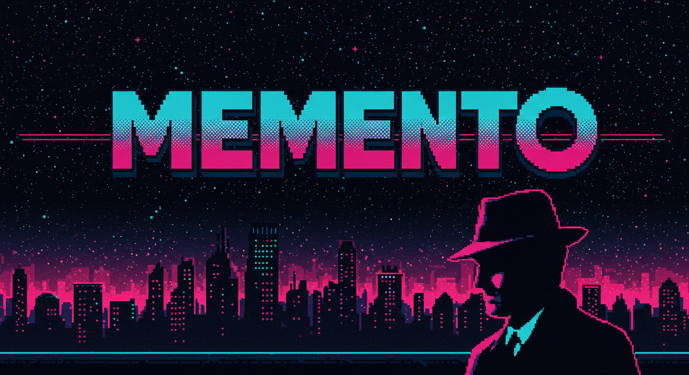

<link rel="stylesheet" type="text/css" href="style.css">

# MEMENTO

**A meta-framework for long-running AI-assisted development. It lives inside the repository of the product it governs, and it has always had two arms: a memory prosthesis, which carries truth between sessions, and operational protocols, which govern conduct within them.**

An AI agent working autonomously for eight hours is impressive. Nobody has watched one develop a product for eight months. Once real work stretches across months and hundreds of separate agent sessions, a different set of problems takes over:

- Which source represents the current truth?
- Which earlier decisions still stand, and why did the architecture change?
- What has already been tried and rejected?
- What did the user actually validate, and what merely *looks* finished?
- What happens when a confident agent inherits only part of that history?

Individual sessions can each feel like progress while the product quietly loses coherence between them. Memento is the system around the agents, and its two arms divide the work: the **memory prosthesis** carries current state and accumulated evidence between sessions, and the **protocols** govern how each session behaves while it runs, with the human's sovereignty over "done" as the first rule. The goal is that each bounded session adds something useful without damaging what the previous hundred sessions established.

## Born in the field, receipted

Memento crystallised in June 2025 inside the repository of a working product and by that August was running in three production implementations. The public canon was abstracted from those three that same month. Then the field kept moving while the canon stood still: the original repository (still running the framework today) and two further estates founded in 2026 carried the framework into a genuinely new era, **falsifiable governance**: enforcement mechanisms that carry pre-registered kill conditions, telemetry that witnesses whether they actually fire, and a documented roll of the mechanisms that died.

The repository is the mid-2026 form of the framework, rebuilt from a receipted audit of that whole lineage. The August 2025 canon is preserved verbatim as the era exhibit: the framework's own continuity discipline, applied to itself.

## The honest status

The current epoch is declared in its early days. The enforcement surface still mostly resists high-level behavioural control; several disciplines remain prose because every attempt to mechanise them has failed its own test. What this framework claims is the honest, receipted mapping of that surface, and no more. The [killed-mechanism roll](https://github.com/jblanch888/MEMENTO/blob/main/story/KILLED_MECHANISMS.md) is the evidence that its governance claims get tested.

## Start here

| | |
|---|---|
| [Getting started](https://github.com/jblanch888/MEMENTO/blob/main/adoption/GETTING_STARTED.md) | Adopt the spirit in an afternoon; earn the apparatus |
| [The graduation ladder](https://github.com/jblanch888/MEMENTO/blob/main/adoption/GRADUATION_LADDER.md) | Spirit → estate → mechanised, with dated field exhibits |
| [The story](https://github.com/jblanch888/MEMENTO/blob/main/story/THE_STORY.md) | The receipted narrative, and the [six epochs](https://github.com/jblanch888/MEMENTO/blob/main/story/EPOCHS.md) |
| [The organ registry](https://github.com/jblanch888/MEMENTO/blob/main/story/ORGAN_REGISTRY.md) | 32 mechanisms traced across the lineage |
| [The killed-mechanism roll](https://github.com/jblanch888/MEMENTO/blob/main/story/KILLED_MECHANISMS.md) | What died, and what each death taught |
| [The enforcement surface](https://github.com/jblanch888/MEMENTO/blob/main/adoption/THE_ENFORCEMENT_SURFACE.md) | What mechanisation has actually earned, mid-2026 |
| [The framework](https://github.com/jblanch888/MEMENTO/tree/main/framework) | What an adopter installs: directives, playbooks, tiers, conventions |
| [The 2025 canon](https://github.com/jblanch888/MEMENTO/tree/main/archive/canon-2025) | The Epoch 4 exhibit, preserved verbatim |

---

*The working metaphor since the beginning: collaborating with a gifted colleague who cannot form new long-term memories, and who is not the same colleague every day (savant one day, journeyman the next, narrowly focused apprentice the day after). The framework is the system of notes, protocols and gates that makes that collaboration compound instead of decay. It is named accordingly.*

[Repository](https://github.com/jblanch888/MEMENTO) · [Contributing](https://github.com/jblanch888/MEMENTO/blob/main/CONTRIBUTING.md) · Licence: MIT
